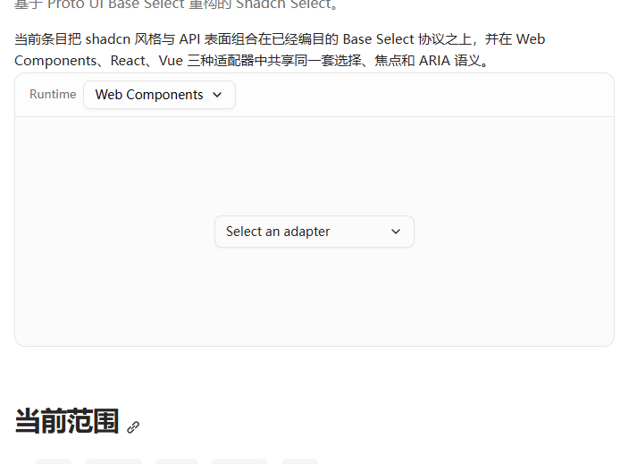
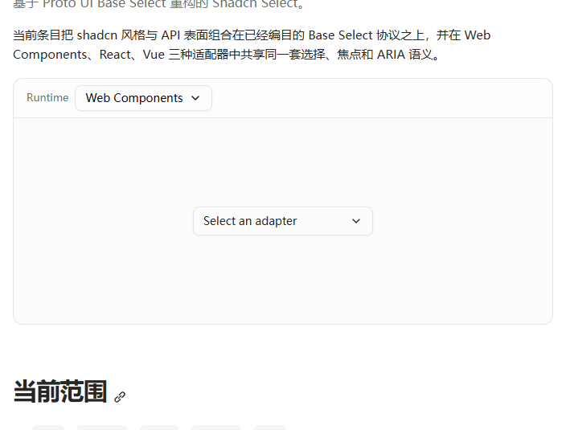
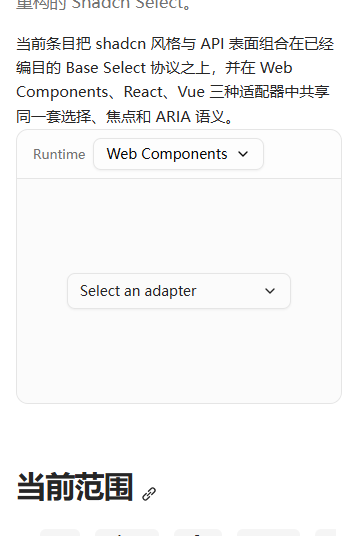
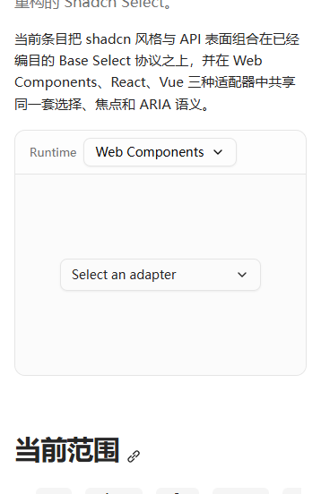
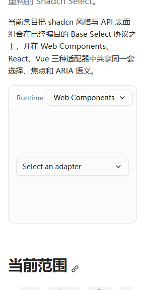

# Issue #579 documentation content-flow evidence

Captured on 2026-09-01 with Chrome 151.0.7922.174 against the Chinese Shadcn Select route. Each before/after pair uses the same browser, viewport, light color scheme, reduced motion, route, and DOM-derived crop.

The `before` frames come from `https://www.proto-ui.com/zh-cn/ui-libraries/shadcn/select/` at the pre-fix production revision. The `after` frames come from the local candidate branch. Exact measured boxes and source URLs are retained in [`geometry.json`](./geometry.json).

| Viewport    | Paragraph → Previewer | Previewer → heading | Header → panel | Root overflow |
| ----------- | --------------------: | ------------------: | -------------: | ------------: |
| 1440 before |                   0px |                64px |            0px |           0px |
| 1440 after  |                  16px |                64px |            0px |           0px |
| 390 before  |                   0px |                64px |            0px |           0px |
| 390 after   |                  16px |                64px |            0px |           0px |
| 320 before  |                   0px |                64px |            0px |           0px |
| 320 after   |                  16px |                64px |            0px |           0px |

## 1440px

| Before | After |
| --- | --- |
|  |  |

## 390px

| Before | After |
| --- | --- |
|  |  |

## 320px

| Before | After |
| --- | --- |
|  |  |

These images are review evidence, not pixel baselines. Executable geometry assertions live in `apps/www/src/content/docs/zh-cn/docs-content-flow.browser.test.ts` so font rasterization and platform paint noise cannot hide or falsely report the spacing contract.
