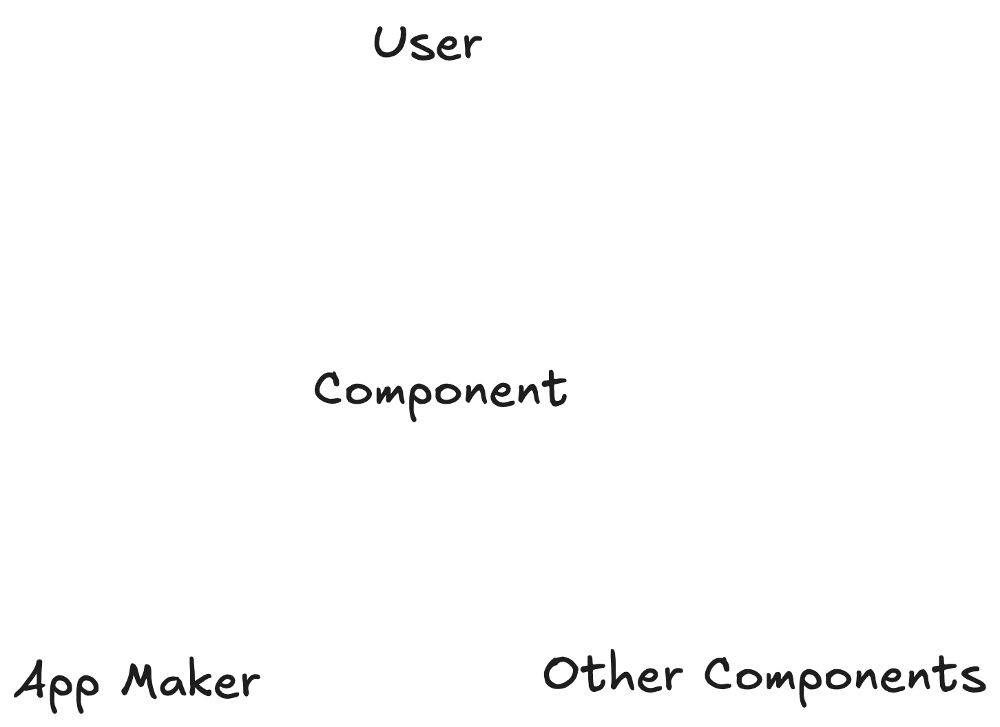
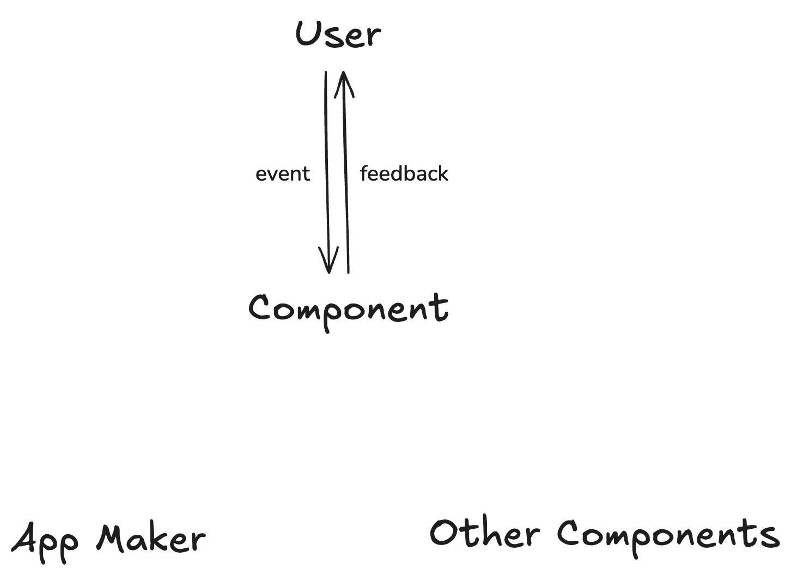
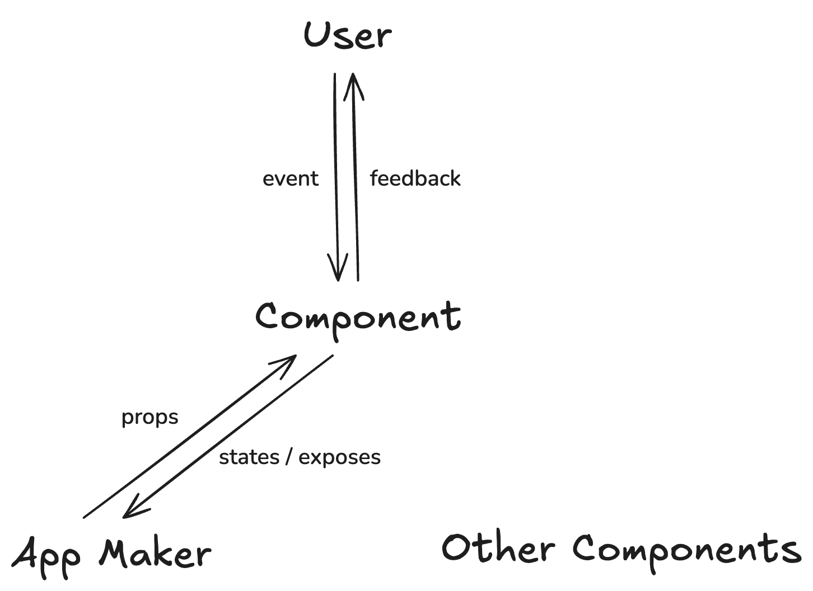
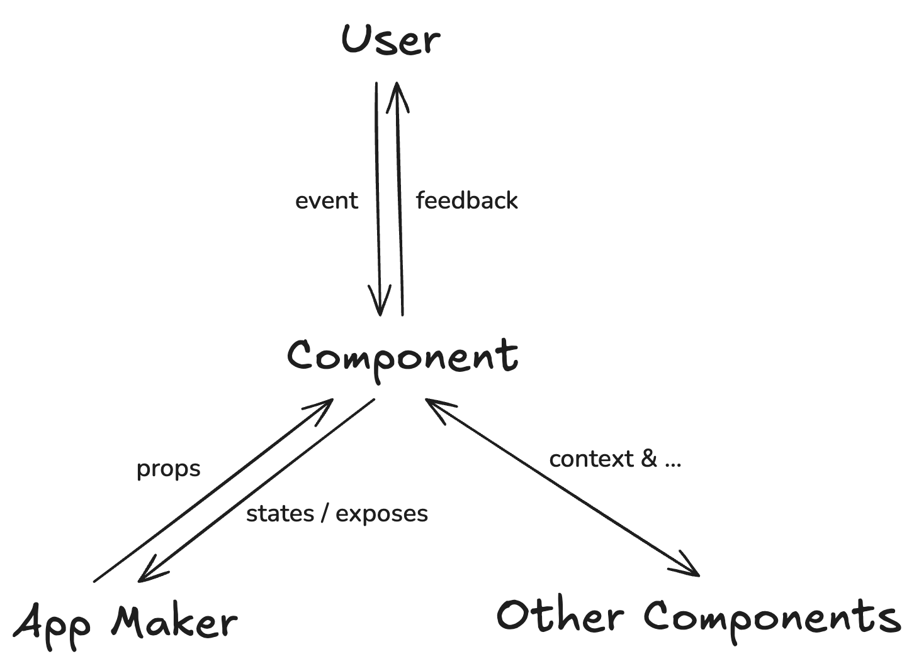
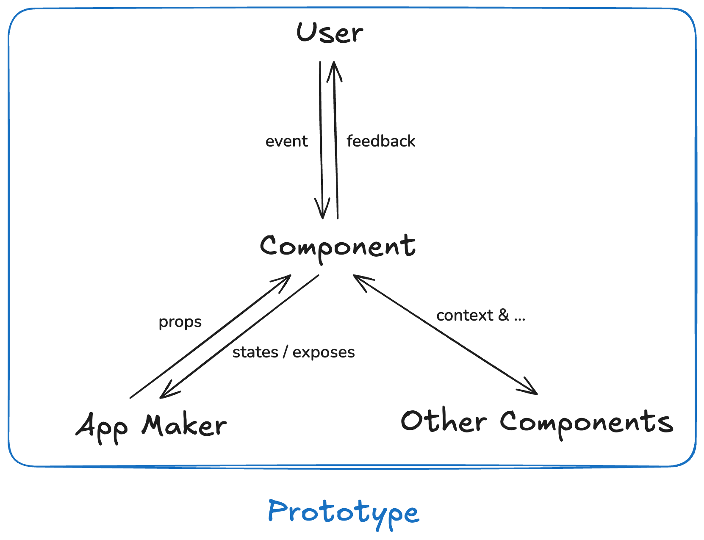

组件原型概念理解
========

一．组件将面对的三类人群
------------

在组件的"生命周期"中，本理论认为它将面对三类人群：

1.     组件作者（Component Author）

2.     应用制作者（App Maker）

3.     用户（User）

对于同一个组件，基于这三类人群，它有三个被观察视角：

1.     Component Author面向的是"组件的本体与抽象"

2.     App Maker面向的是"如何用组件构建应用"

3.     User面向的是"使用体验"

根据这三类人群，我们可以这样描述组件：

**组件是由Component Author制造出来，用于给App Maker使用，并最终为User提供服务的逻辑实体**

（为何要强调"逻辑实体"，因为本理论希望不被技术体系束缚，而是从**信息互动系统**的角度来看待组件）

二．组件应该具备的三条信息通路
---------------

根据这个定义，我们可以提炼出两条关于组件的信息通路：

**组件与User**以及**组件与App Maker**（显然Component Author不需要与组件间拥有信息通路，他们测试组件时使用的实质上是App maker与组件间的信息通路）

而在现实中的项目，基本不可能是由一个不可拆分的大组件构成的，所以组件与其他组件的信息交流也非常重要

故三条信息通路分别为：

**组件 <--> User**

**组件 <--> App Maker**

**组件 <--> 其他组件**

### （一）.User与组件：动作与反馈的循环

对User来说，组件是一种"可以被操作并产生反馈的界面元素"。

User通过各种方式向组件发出动作输入：

\- 点击、触摸、键盘输入

\- 各种交互方式（手势等）

组件对这些动作做出的反应，构成了 User 能直接感知的反馈输出：

\- 视觉或布局上的变化

\- 层级结构的变化（展开 / 收起 / 盖住 / 退后）

\- 其他感官上的反馈：音效、震动等等

如果我们先不管这个过程由何种技术实现，这条通路可以简化为：

1\. User → 组件：动作（action） 

2\. 组件 → User：反馈（feedback）

无论你用哪种技术来构建人机交互，只要一个东西具备这条动作--反馈循环，它在 User 的视角下就具备了"组件"的基本特征。

### （二）App Maker 与组件：参数配置和状态监控

App Maker是在开发阶段"使用组件"的人。

他们**并不设计组件本身**，而是选择在哪个场景用组件的哪个变体，并在每一次具体使用时，为组件填入合适的配置参数。

需要注意的是：

组件有哪些能力、有哪些可配置项由Component Author决定，

而在某个具体界面 / 功能里要使用哪些组件、启用哪些选项、填入哪些参数：由 App Maker 决定

以魔方打比方，能被怎么拧由Component Author决定，而具体怎么拧由App Maker 决定。

因此，对 App Maker 来说，这条通路更像是：

Component Author 决定组件能"被如何使用"

App Maker 在这个边界内，决定"在某个场景下如何实际使用"；

组件则通过有限的对外暴露（相当于"接口"或"通道"），让 App Maker 能够观察、协调和组合它

总结来讲：

\- App Maker → 组件：配置 (options)

\- 组件 → App Maker：对外状态、可调用方法（exposes）

\- App Maker 是组件的"调用者"和"编排者"，不是组件的设计者

\- 组件的"可配置性"来自 Component Author 的设计，而不是 App Maker 的任意需求

### (三).组件与组件：结构位置与语义协作

在一个非玩具级的应用里，组件几乎不会单独存在。它们必须和其他组件组成更大的界面结构，这就需要**组件与组件之间的协作**。

例如触发器与它控制的弹出层（如鼠标悬停/点击会触发下拉菜单的组件）或滚动区域与滚动条（滚动区域发生滚动，滚动条会跟着动）

从信息流角度看，组件之间需要传递的信息包括：

谁属于哪个区域或结构（谁包含谁，谁与谁的顺序关系如何等）

某种共享上下文（例如当前状态、布局方向）

有时也会直接调用其他组件，就像 App Maker 会做的那样（马上会提到）

一个上层组件在"使用"某个下层组件时，也会在局部扮演 **App Maker** 的角色：它为子组件提供参数，监听子组件的输出，进而构成更大的界面模块。（例如网页底部一直不变但是可以交互的地图栏与Navigation组件的关系）

在这一层，组件不只是独立元素，而是**构成界面结构的节点**。

总结来说，组件之间的通信是对称的（并非双向而是地位对等），并且会包含 App Maker 的部分，但最独特的还是它们对于结构和上下文的通信。

组件 <-> 组件: 上下文、结构（context、struct）

同时，组件与 App Maker 发生的通信也能发生在组件之间

三．三条通路共同定义了组件的本质
----------------

通过三条信息通路，我们可以这样描述组件：

**它是界面信息系统中的一个节点，通过三条通路分别与 User、App Maker 与其他组件交换信息，从而在界面中形成一个稳定的逻辑单元**

模板、函数、类、渲染方法，是实现这三条通路的可能手段

而框架选择、渲染技术、状态管理方案，都是后续的技术决策

而对于一个组件的定义，首先在于：

1.它如何接收来自 User 的动作，如何为 User 提供反馈

2.它如何接收来自 App Maker 的配置，如何将自身可以暴露给 App Maker 的属性与行为暴露出去

3.它如何与其他组件共享结构和上下文

**我们把能够准确描述这些信息通路的内容，又不涉及具体实现的中间表示，叫做组件原型。**

因为没有具体实现，所以它可以用各种语言来表示，在各个平台中切换，**它是一个组件在不同技术实现中保持不变的部分**

